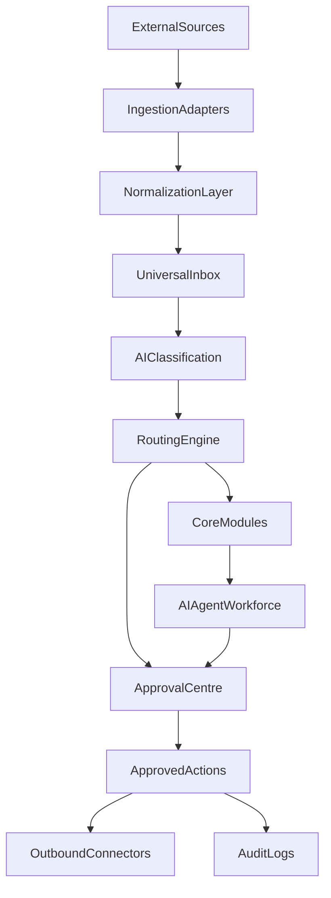

> **SUPERSEDED 2026-08-14.** Historical reference only, no authority.
> Current authority: `plan/03_AGENT_REGISTRY.md` (12 archetypes, not 18 named agents) and `plan/05_INTEGRATION_MATRIX.md`.

# Integration and AI Agent Blueprint — PivotOS

## Canonical Naming Glossary (Lock)
Use these labels exactly across all planning and build documents:

- **Global Command Centre** (not “command center” or generic “dashboard”)
- **Today View** (not “Today” when naming a core screen)
- **Universal Inbox**
- **Entity Workspace**
- **Quick Capture**
- **Command Bar**
- **AI Agent Workforce**
- **Automation Builder**
- **Idea-to-Wealth Engine**
- **Opportunity Cards**
- **Revenue Stream Builder**
- **Approval Centre**
- **Activity Log**
- **Audit Log**
- **Integrations Hub**

Phase naming lock:
- **Phase 2: Global Command Centre, Today View, Quick Capture**
- **Phase 7: Opportunity Cards + Idea-to-Wealth Engine**

## 1) Blueprint Objectives
- Turn PivotOS into a connected operating system, not an isolated app.
- Use phased integrations so value starts early without waiting for perfect APIs.
- Build an AI workforce that is useful, auditable, and safe.
- Enforce approval and audit controls for risky actions.

---

## 2) Integration Phasing Model
- **Phase 1**: Manual import/export, links, CSVs, copy-to-inbox
- **Phase 2**: Zapier/Make/n8n/API bridges + webhooks
- **Phase 3**: Native integrations with sync contracts
- **Phase 4**: AI-driven autonomous workflows (approval-gated)

---

## 3) Integration Catalog

## WhatsApp
| Field | Details |
|---|---|
| Business purpose | Lead capture, follow-up, buyer/seller communications |
| Data pulled in | conversations, sender metadata, timestamps, media refs |
| Data pushed out | drafts, approved outbound messages, template sends |
| Technical method | P1 manual paste; P2 provider API; P3 native threads; P4 agent orchestration |
| User permissions | entity-scoped comms access |
| Possible automations | no-reply reminders, lead-to-task, follow-up timers |
| AI agent involved | WhatsApp Follow-Up Agent, Relationship Agent |
| MVP approach | conversation summary + draft suggestions only |
| Advanced approach | thread intelligence + sequence automation |
| Security risks | accidental wrong-recipient sends, sensitive data in chats |
| Human approval rules | required for outbound high-impact messages |

## Gmail
| Field | Details |
|---|---|
| Business purpose | Email triage, task extraction, lead and invoice detection |
| Data pulled in | messages, sender, labels, attachments metadata |
| Data pushed out | draft replies, approved send actions |
| Technical method | P1 manual forwards; P2 OAuth API bridge; P3 native sync; P4 autonomous triage loops |
| User permissions | mailbox-scoped read/write by consent |
| Possible automations | classify by entity, create tasks/events/deals |
| AI agent involved | Email Triage Agent, Chief of Staff Agent |
| MVP approach | summary + classification suggestions |
| Advanced approach | auto-prioritization and follow-up campaigns |
| Security risks | sensitive financial/legal data exposure |
| Human approval rules | required for sending emails |

## Google Contacts
| Field | Details |
|---|---|
| Business purpose | unify people graph across entities |
| Data pulled in | contacts, phone, email, company tags |
| Data pushed out | new/updated contacts from PivotOS |
| Technical method | P1 CSV import; P2 API sync via middleware; P3 native |
| User permissions | contact scope + entity mapping controls |
| Possible automations | contact enrichment, duplicate merge alerts |
| AI agent involved | Relationship Intelligence Agent |
| MVP approach | import-only + dedupe suggestions |
| Advanced approach | bi-directional sync with conflict controls |
| Security risks | mis-linked contacts across entities |
| Human approval rules | required for merge/delete operations |

## Google Calendar
| Field | Details |
|---|---|
| Business purpose | schedule control, meeting sync, prep and follow-up |
| Data pulled in | events, attendees, locations, reminders |
| Data pushed out | meetings created in PivotOS |
| Technical method | P1 placeholder/manual; P2 API bridge; P3 native bi-sync |
| User permissions | calendar read/write |
| Possible automations | meeting prep pack, post-meeting tasks |
| AI agent involved | Meeting Agent, Chief of Staff Agent |
| MVP approach | planning placeholder + import assist |
| Advanced approach | two-way sync + travel-time suggestions |
| Security risks | privacy leakage of personal events |
| Human approval rules | required for creating external calendar invites |

## Google Drive
| Field | Details |
|---|---|
| Business purpose | file references and document context |
| Data pulled in | file metadata, links, selected file content |
| Data pushed out | generated reports/docs links |
| Technical method | P1 link attach; P2 API metadata sync; P3 native doc context |
| User permissions | selected file scope only |
| Possible automations | auto-attach docs to deals/projects |
| AI agent involved | Document Agent |
| MVP approach | attach links, manual relation |
| Advanced approach | contextual retrieval for AI summaries |
| Security risks | over-broad file access |
| Human approval rules | required for any bulk file operations |

## Google Docs
| Field | Details |
|---|---|
| Business purpose | extract action items, summaries, contract clauses |
| Data pulled in | doc text and metadata |
| Data pushed out | draft docs from templates |
| Technical method | P1 copy/paste; P2 API read; P3 native contextual sync |
| User permissions | doc-level consent |
| Possible automations | task extraction from meeting docs |
| AI agent involved | Document Agent, Meeting Agent |
| MVP approach | summarize + action extraction |
| Advanced approach | live sync and clause intelligence |
| Security risks | legal doc sensitivity |
| Human approval rules | required for sending/generated final docs |

## Google Sheets
| Field | Details |
|---|---|
| Business purpose | temporary operational data import and reports |
| Data pulled in | selected ranges, sheet metadata |
| Data pushed out | report exports |
| Technical method | P1 CSV import; P2 API read; P3 mapped sync pipelines |
| User permissions | sheet/range consent |
| Possible automations | sheet-to-record conversion |
| AI agent involved | Finance Agent, Opportunity Radar |
| MVP approach | one-time imports |
| Advanced approach | mapped scheduled sync |
| Security risks | stale/duplicate data |
| Human approval rules | required for overwrite/update mapping actions |

## Google Keep/Notes
| Field | Details |
|---|---|
| Business purpose | capture ideas and quick notes |
| Data pulled in | note content where supported |
| Data pushed out | optional task/idea exports |
| Technical method | P1 manual copy; P2 if available via connectors |
| User permissions | note-scope consent |
| Possible automations | note-to-opportunity conversion |
| AI agent involved | Wealth Ideas Agent |
| MVP approach | manual import workflow |
| Advanced approach | selective sync if feasible |
| Security risks | personal note privacy |
| Human approval rules | required for converting sensitive notes |

## Facebook / Instagram / LinkedIn / TikTok
| Field | Details |
|---|---|
| Business purpose | content pipeline and lead capture |
| Data pulled in | post metrics, comments/messages where available |
| Data pushed out | approved content drafts/schedules |
| Technical method | P1 manual tracking; P2 social tool bridge; P3 native platform APIs where possible |
| User permissions | page/account scoped |
| Possible automations | lead-to-task, repurpose content, campaign reminders |
| AI agent involved | Content Repurposing Agent, Opportunity Radar |
| MVP approach | content idea board + manual publish workflows |
| Advanced approach | omnichannel scheduling and lead ingestion |
| Security risks | brand/reputation risk on wrong posts |
| Human approval rules | mandatory for publishing public content |

## Digikraal website / Farm Feed website / DJ Eksteen + North Point landing pages
| Field | Details |
|---|---|
| Business purpose | website lead capture into entity pipelines |
| Data pulled in | form submissions, source metadata, page context |
| Data pushed out | lead status and follow-up outcomes |
| Technical method | P1 manual entry; P2 webhook forms; P3 native lead API connectors |
| User permissions | entity lead handling permissions |
| Possible automations | create contact+deal+follow-up automatically |
| AI agent involved | Opportunity Radar, Deal Intelligence |
| MVP approach | webhook-ready placeholders + manual processing |
| Advanced approach | routed leads by entity/division and SLA timers |
| Security risks | spam and malicious payloads |
| Human approval rules | required for external follow-up sends |

## Jira
| Field | Details |
|---|---|
| Business purpose | product and engineering execution visibility |
| Data pulled in | tickets, status, assignees, sprints |
| Data pushed out | generated ticket drafts |
| Technical method | P1 manual links; P2 API sync |
| User permissions | project-level access |
| Possible automations | idea-to-ticket conversion |
| AI agent involved | Development Agent |
| MVP approach | ticket mirror + summaries |
| Advanced approach | roadmap alignment automations |
| Security risks | exposing internal dev data to wrong users |
| Human approval rules | required before creating/editing tickets externally |

## Confluence
| Field | Details |
|---|---|
| Business purpose | docs knowledge retrieval for product and ops |
| Data pulled in | pages, sections, doc metadata |
| Data pushed out | generated summaries/references |
| Technical method | P1 manual attach; P2 API read sync |
| User permissions | space/page access controls |
| Possible automations | decision extraction and doc links to records |
| AI agent involved | Document Agent, Development Agent |
| MVP approach | manual references |
| Advanced approach | semantic retrieval in AI assistant |
| Security risks | policy/confidential docs leakage |
| Human approval rules | required for publishing new docs externally |

## Airtable Digikraal / Airtable Farm Feed
| Field | Details |
|---|---|
| Business purpose | migration bridge for existing deal operations |
| Data pulled in | deals, stages, contacts, notes |
| Data pushed out | optional updates while transitioning |
| Technical method | P1 CSV/manual; P2 API sync; P3 managed migration |
| User permissions | base/table scoped tokens |
| Possible automations | dedupe and mapping workflows |
| AI agent involved | Deal Intelligence Agent |
| MVP approach | import snapshots into PivotOS |
| Advanced approach | controlled bi-sync then cutover |
| Security risks | duplicate and conflicting records |
| Human approval rules | required for schema mapping and cutover steps |

## Propverse / Property24
| Field | Details |
|---|---|
| Business purpose | property listing operations and lead tracking |
| Data pulled in | listings, enquiries, status where available |
| Data pushed out | listing updates if permitted |
| Technical method | P1 manual workflow; P2 semi-automated import; P3 API integration if available |
| User permissions | brokerage/account controlled |
| Possible automations | viewing reminders, listing checklists, lead follow-up |
| AI agent involved | Property Agent |
| MVP approach | manual-first cockpit with checklist support |
| Advanced approach | performance tracking and recommendation engine |
| Security risks | incorrect listing or sensitive client data handling |
| Human approval rules | required for listing/public status changes |

## Xero / Accounting + Payment Gateways + Banking Exports
| Field | Details |
|---|---|
| Business purpose | money visibility and financial workflow integrity |
| Data pulled in | invoices, bills, payments, balances, export files |
| Data pushed out | drafts, categorized transactions, report exports |
| Technical method | P1 manual upload; P2 connector tools; P3 native accounting integration |
| User permissions | finance-admin scoped + strong controls |
| Possible automations | unpaid invoice alerts, reconciliation cues |
| AI agent involved | Finance Admin Agent, Business Health Agent |
| MVP approach | manual finance records + alerts |
| Advanced approach | near-real-time sync and reconciliation support |
| Security risks | high sensitivity financial data |
| Human approval rules | mandatory for financial record changes and outgoing payment actions |

---

## 4) Universal Inbox Architecture
Flow:
1. Ingestion adapters (manual/API/webhook/import)
2. Normalization layer
3. Entity classification engine
4. AI triage + confidence scoring
5. Routing actions (task/deal/meeting/contact/doc/opportunity/automation)
6. Approval gate (for risky outbound actions)
7. Audit logging

Data model components:
- `inbox_items`
- `inbox_sources`
- `inbox_classifications`
- `inbox_actions`
- `inbox_action_results`

---

## 5) AI Agent Workforce Architecture
Core layers:
- Agent Registry (`ai_agents`)
- Context Layer (`ai_memory`, entity-scoped)
- Task Queue (`ai_actions`)
- Conversation Layer (`ai_threads`)
- Approval Layer (`approvals`)
- Audit Layer (`audit_logs`)

Agent execution policy:
- no cross-entity access without explicit permissions
- every action tagged with confidence, risk, and approval requirement

---

## 6) AI Agent Definitions (18)
For every agent:
- job description
- connected apps
- required data access
- can perform vs can suggest only
- approval requirements
- risks
- audit fields
- UI card pattern
- daily and weekly outputs

### Agent cards (summary)
1. Chief of Staff Agent — daily priorities, risk alerts, war room outputs
2. WhatsApp Follow-Up Agent — lead extraction and follow-up drafts
3. Email Triage Agent — classify, prioritize, draft, task extraction
4. Deal Intelligence Agent — deal progression and stuck warnings
5. Wealth Ideas Agent — idea-to-opportunity conversion
6. Content Repurposing Agent — one idea to multichannel content
7. Property Agent — listing/mandate/viewing/OTP workflows
8. Digikraal Livestock Agent — listing to payment logistics chain
9. Farm Feed Commodity Agent — buyer/seller/contract flow management
10. Finance Admin Agent — cashflow warnings and invoice follow-up
11. Meeting Agent — agenda, notes, tasks, reminders
12. Development Agent — idea-to-ticket and sprint summaries
13. Document Agent — extract actions from docs/files
14. Opportunity Radar Agent — hidden opportunity detection
15. Automation Builder Agent — identify repetitive work and propose automations
16. Relationship Intelligence Agent — follow-up memory and promise tracking
17. Revenue Stream Builder Agent — new income stream suggestions
18. Business Health Agent — entity health scoring

---

## 7) Automation Builder Architecture
Automation schema:
- trigger
- condition
- action
- required approval
- notification policy
- audit payload

Execution lifecycle:
- draft -> test -> active -> paused -> archived

Safety controls:
- dry-run mode
- rollback markers
- approval timeout fallback
- rate limits and retry policies

---

## 8) Idea-to-Wealth Engine
Stages:
1. capture idea
2. enrich and structure
3. score and rank
4. assign first 3 actions
5. track execution and outcomes

Outputs:
- opportunity cards
- quick cash queue
- long-term ventures queue
- revenue stream dashboard

---

## 9) Revenue Stream Builder
Sources:
- existing deals/contacts/assets/content/audiences
- identified market gaps
- recurring demand signals

Planner outputs:
- monetization model suggestions
- launch speed estimate
- effort/risk curve
- automation potential score

---

## 10) Human Approval and Audit Log System
Approval required for:
- outbound WhatsApp and email sends (non-trivial)
- deleting records
- financial writes and invoice changes
- contracts and legal document dispatch
- permission changes/invites
- public social publishing
- final deal status transitions (sold/paid/completed)

Audit log minimum fields:
- actor (human/agent)
- entity
- action
- target record
- before/after snapshot
- approval reference
- timestamp

---

## 11) Security and Privacy Standards
- strict entity isolation
- least privilege access
- encrypted token storage
- secret rotation policy
- anti-duplication and anti-cross-link checks
- anomaly alerts on high-risk actions

---

## 12) Development Phase Alignment (from MASTERPLAN.md)
This blueprint follows the same phase order defined in `MASTERPLAN.md` section `23) Development Phases`.

- Phase 0: product clarity + UX architecture + schema planning
- Phase 1: auth, entities, roles, permissions, base RLS
- Phase 2: Global Command Centre, Today View, Quick Capture
- Phase 3: inbox, tasks, meetings, projects, notes
- Phase 4: contacts, CRM, deals, activity logs
- Phase 5: docs/files/reports
- Phase 6: finance basics + assets
- Phase 7: Opportunity Cards + Idea-to-Wealth Engine
- Phase 8: integration registry/manual connectors
- Phase 9: Google Workspace integration
- Phase 10: Airtable sync
- Phase 11: WhatsApp integration + draft replies
- Phase 12: website lead capture
- Phase 13: property workflows
- Phase 14: social content engine
- Phase 15: Jira/Confluence integration
- Phase 16: accounting/payment integrations
- Phase 17: advanced AI agent automation
- Phase 18: polish, performance, deployment

---

## 13) 90-Day Build Roadmap (Practical)

### Days 1–15
- finalize schema contracts and RLS strategy
- implement integration registry + connection status pages
- ship manual integration records in UI
- ship approval centre skeleton

### Days 16–30
- ship inbox ingestion core (manual + webhook entry points)
- implement AI triage for inbox items
- ship command bar + quick capture in all key pages
- implement activity/audit foundation

### Days 31–45
- calendar and gmail placeholder workflows with draft pipelines
- basic deal intelligence signals and follow-up timers
- opportunity card creation from inbox and capture

### Days 46–60
- Airtable import pipelines (Digikraal + Farm Feed)
- website lead capture webhooks and routing
- meeting agent outputs (agenda, notes, tasks)

### Days 61–75
- WhatsApp integration phase (provider selection + draft workflow)
- finance alerting baseline (unpaid and due reminders)
- business health score v1 per entity

### Days 76–90
- integration hardening and reliability controls
- automation builder templates
- performance tuning for mobile/PWA offline sync
- launch readiness checklist for controlled pilot

---

## 14) Integration Architecture Diagram

## 15) Build Principles for Integration Work
- Start with reliability and visibility before depth.
- Prefer reversible, modular connectors.
- Keep every connector entity-aware and permission-aware.
- Never block core operations because an external integration is down.
- Always offer manual fallback actions.
