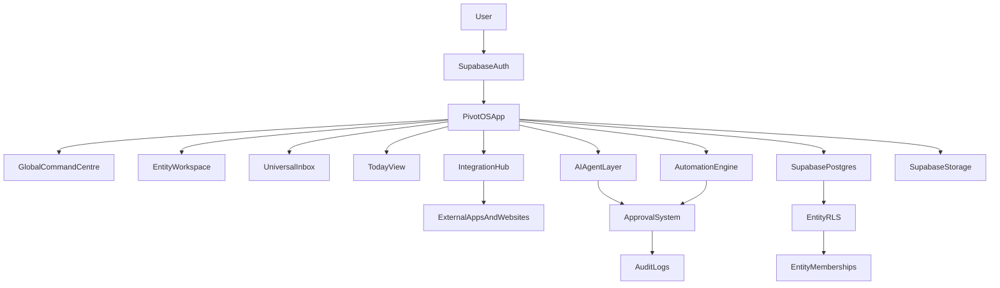

# PivotOS Masterplan

## Canonical Naming Glossary (Lock)
Use these labels exactly across all planning and build documents:

- **Global Command Centre** (not “command center” or generic “dashboard”)
- **Today View** (not “Today” when naming a core screen)
- **Universal Inbox**
- **Entity Workspace**
- **Quick Capture**
- **Command Bar**
- **AI Agent Workforce**
- **Automation Builder**
- **Idea-to-Wealth Engine**
- **Opportunity Cards**
- **Revenue Stream Builder**
- **Approval Centre**
- **Activity Log**
- **Audit Log**
- **Integrations Hub**

Phase naming lock:
- **Phase 2: Global Command Centre, Today View, Quick Capture**
- **Phase 7: Opportunity Cards + Idea-to-Wealth Engine**

## 1) Executive Summary
PivotOS is an AI-powered Business Operating System that helps an entrepreneur run personal life, multiple companies, teams, deals, operations, communication, documents, automations, and wealth opportunities from one Command Centre.

This is not a generic task app. It is a decision and execution system designed to reduce cognitive load, protect focus, improve follow-through, and increase revenue outcomes.

Primary architecture direction:
- Frontend: **Next.js + Tailwind CSS** (best long-term SaaS architecture for scale, routing, SEO pages, docs pages, and app shell)
- Backend: **Supabase** (Auth, Postgres, Storage, Edge Functions, Realtime)
- UX mode: **Mobile-first PWA, desktop-powerful, offline-first with sync**

---

## 2) Product Vision
PivotOS becomes:
- a universal Global Command Centre across entities
- an AI workforce layer, not an AI gimmick
- a privacy-safe multi-entity platform
- an opportunity intelligence system
- an automation engine with human approval controls

North star: open app -> instantly know what matters now, what makes money now, what is blocked, and what AI can do safely.

---

## 3) Core Philosophy
- **Clarity over complexity**: cards first, dense data only on demand.
- **Action over organization**: every screen drives decisions and next actions.
- **Entity separation by default**: no accidental cross-company leakage.
- **AI as worker layer**: draft, summarize, classify, suggest, escalate.
- **Human approval for risk**: no high-risk autonomous actions.
- **Mobile excellence first**: phenomenal on mobile, strong on desktop.

---

## 4) Target Users
- Founder-operators running multiple entities
- Entrepreneurs with mixed personal + business responsibilities
- Small teams inside separate companies/business units
- Operations-heavy users (deals, logistics, finance, follow-up)
- Revenue-focused users who need execution support, not admin burden

---

## 5) Main Problems Solved
- Fragmented tools and context switching
- Missed follow-ups and lost opportunities
- No single truth for tasks, meetings, deals, and money movement
- Weak prioritization (urgent vs important vs revenue-critical)
- Poor visibility across entities/divisions
- Manual repetitive admin with no automation intelligence

---

## 6) Main User Journeys
1. **Morning War Room**
   - Open Global Command Centre -> see top priorities, risks, meetings, money actions -> execute.
2. **Universal Inbox Processing**
   - Pull items from channels -> classify -> convert to tasks/deals/follow-ups/automations.
3. **Entity Ops Loop**
   - Switch entity -> monitor dashboard -> run meetings/deals/tasks/logistics -> close loops.
4. **Idea-to-Wealth Engine**
   - Capture idea -> score opportunity -> choose first 3 actions -> launch MVP path.
5. **Delegation and Team Control**
   - Invite team per entity -> assign tasks/approvals -> track execution safely.

---

## 7) Full Feature List
- Global Command Centre
- Entity switcher + All Entities mode
- Entity workspaces (dashboard + modules)
- Universal Inbox
- Today View
- Command bar
- Quick capture (text/voice/file/screenshot)
- Tasks, Meetings, Calendar, Notes, Documents
- Contacts/CRM, Projects, Deals
- Finance basics, assets, reports
- Automations + approvals
- AI agents panel + outputs
- Opportunity cards + Revenue Stream Builder
- Integrations hub + sync health
- Activity + audit logs
- Landing page + product marketing pages + how-to pages

---

## 8) App Navigation Structure
- **Global top layer**
  - Global Command Centre
  - Today View
  - Universal Inbox
  - Search/Command bar
- **Entity layer**
  - Dashboard, Tasks, Meetings, Calendar, Contacts, Deals, Finance, Documents, Reports, Automations, AI Agents, Settings
- **Special layer**
  - Idea-to-Wealth Engine
  - Revenue Stream Builder
  - Integrations
  - Admin/Permissions

---

## 9) Entity/Workspace System
- Entity types: Personal, Company, Project Venture, Brand
- Each entity has:
  - users, roles, permissions
  - modules and settings
  - own records (tasks, meetings, deals, docs, financial objects)
  - own integrations and automations
- Super admin can access entities where membership permits
- All entities mode is a filtered meta-view, not a data-merge override

---

## 10) Core Modules
- Dashboard
- Universal Inbox
- Today View
- Tasks
- Meetings
- Calendar
- Notes
- Documents
- Contacts
- Projects
- Deals
- Finance
- Assets
- Reports
- Automations
- AI Agents
- Settings

---

## 11) Business-Specific Modules
- Property
- Livestock
- Farm Feed/Commodities
- Inventory/Stock
- Logistics
- Development/Tickets
- Marketing
- Legal/Contracts
- Website/Platform Management
- Social Media
- Idea-to-Wealth Engine
- Revenue Stream Builder

---

## 12) AI Agent Workforce
Planned agent roster (18):
- Chief of Staff
- WhatsApp Follow-Up
- Email Triage
- Deal Intelligence
- Wealth Ideas
- Content Repurposing
- Property Agent
- Digikraal Livestock Agent
- Farm Feed Commodity Agent
- Finance Admin Agent
- Meeting Agent
- Development Agent
- Document Agent
- Opportunity Radar
- Automation Builder
- Relationship Intelligence
- Revenue Stream Builder Agent
- Business Health Agent

Agent model principles:
- explicit scopes
- per-entity data boundaries
- action vs suggestion permissions
- approval gating
- full action/audit logs

---

## 13) Universal Inbox
Sources:
- WhatsApp, Gmail, Calendar, Contacts, Drive/Docs/Sheets, Airtable, websites, social channels, Jira/Confluence, manual capture

Inbox actions:
- classify, assign entity/division
- convert to task/meeting/deal/contact/document/opportunity/automation
- summarize, draft reply, snooze, mark waiting/urgent, archive

Inbox objective:
- one intake lane before records become structured work.

---

## 14) Idea-to-Wealth Engine
- Idea Inbox -> Opportunity Cards -> Ranked Ventures -> MVP Planner -> Revenue Dashboard
- Opportunity Card fields:
  - idea, entity, customer, problem, revenue model, launch speed, difficulty, startup cost, monthly upside, risk, first actions, AI MVP plan, decision
- Scoring model:
  - fastest path to cash
  - lowest effort
  - highest upside
  - best asset fit
  - easiest automation potential

---

## 15) Automation Layer
Automation structure:
- Trigger -> Condition -> Action -> Approval rule -> Notification -> Audit log

Example automations:
- meeting ended -> summarize + create follow-up tasks
- overdue task -> escalate
- deal stage changed -> create next checklist
- unpaid invoice -> notify responsible owner
- lead not followed up in 24h -> draft follow-up for approval

---

## 16) Connected Ecosystem & Integration Strategy
Phased strategy:
- **Phase 1**: Manual import/link + placeholders
- **Phase 2**: Zapier/Make/n8n + webhook/API adapters
- **Phase 3**: Native deep integrations
- **Phase 4**: AI-assisted autonomous workflows (approval-gated)

Priority integrations:
- WhatsApp, Gmail, Google Calendar, Google Contacts, Google Drive/Docs/Sheets
- Airtable (Digikraal + Farm Feed)
- Propverse + Property24 (manual first)
- Jira + Confluence
- websites lead capture

---

## 17) Database Schema Plan (Supabase)
High-level domain groups and primary entities:

| Domain | Tables (planned) |
|---|---|
| Identity & Access | users, entities, entity_members, roles, permissions |
| Workspace Config | modules, module_settings, integrations, integration_accounts |
| Work Core | inbox_items, tasks, meetings, projects, notes, documents |
| CRM & Deals | contacts, companies, deals, deal_stages, activity_logs |
| Vertical Ops | properties, livestock_listings, commodity_listings, logistics_jobs, inventory |
| Finance | purchases, sales, expenses, invoices, payments, assets |
| AI Layer | ai_agents, ai_threads, ai_actions, ai_memory |
| Automation | automations, automation_runs, approvals, notifications |
| Intelligence | opportunity_cards, revenue_streams, business_health_scores |
| Compliance | audit_logs |

Schema rules:
- every business table has `entity_id`
- critical records include owner and status lifecycles
- immutable audit trail for sensitive operations

---

## 18) Supabase RLS/Security Plan
- Entity-level isolation via `entity_members` membership checks
- Role-driven permissions (`owner/admin/member/viewer/custom`)
- Row access requires active membership to `entity_id`
- Cross-entity reads blocked by default
- Integration tokens encrypted and scoped per entity
- AI actions logged; high-risk actions require approvals
- Storage buckets and paths scoped by entity/user permissions
- Immutable audit logs for invites, permissions, financial edits, final deal changes

---

## 19) UX/UI Design Direction
Style:
- premium, calm, modern SaaS
- green/black/white accent system
- soft gradients, rounded modular cards, clean status pills

Stitch inspiration source for implementation:
- Imported local references from:
  - `design/stitch/base`
  - `design/stitch/variant1`
  - `design/stitch/variant2`
  - `design/stitch/variant3`
- Token direction extracted:
  - Font family: **Manrope**
  - Base spacing rhythm: **8px scale**
  - Radius system: **8/12/16px**
  - Palette anchor: **Primary green** + **secondary blue** + clean neutral surfaces
  - Layout style: **card-first**, soft shadows, subtle borders, clear status chips

Interaction principles:
- command bar always available
- quick capture globally accessible
- progressive disclosure
- card-first layouts with switchable views (table/kanban/calendar/timeline)

Brand feel:
- trusted professional operating console
- high clarity under pressure

---

## 20) Page-by-Page Breakdown
Core pages:
- Landing
- Login/Register
- Onboarding
- Create Entity
- Invite Team
- Global Command Centre
- Today View
- Universal Inbox
- Entity Dashboard
- Tasks
- Meetings
- Calendar
- Projects
- Contacts/CRM
- Deals
- Property
- Livestock
- Farm Feed Commodities
- Finance
- Documents
- Reports
- Automations
- AI Agents
- Idea-to-Wealth Engine
- Revenue Stream Builder
- Integrations
- Settings
- Admin/Permissions

Each page spec must include:
- purpose, components, actions, AI assist, empty states, mobile behavior, required data

---

## 21) Module-by-Module Breakdown
For each module, define:
- primary jobs-to-be-done
- main data objects and statuses
- key user actions
- AI augmentations
- automation touchpoints
- role restrictions
- KPI indicators

Initial module priorities:
- Global Command Centre, Today View, Universal Inbox, Tasks, Meetings, Deals, Contacts, Opportunity Cards

---

## 22) MVP Definition
MVP includes:
- login/auth
- entity switcher + role-based access
- Global Command Centre
- Universal Inbox
- quick capture
- tasks
- meetings
- contacts
- deals
- opportunity cards
- AI assistant placeholder
- manual integration records
- calendar and WhatsApp/Gmail draft placeholders
- approvals placeholder
- activity log baseline

MVP excludes deep native integrations initially.

---

## 23) Development Phases
- Phase 0: product clarity + UX architecture + schema planning
- Phase 1: auth, entities, roles, permissions, base RLS
- Phase 2: Global Command Centre, Today View, Quick Capture
- Phase 3: inbox, tasks, meetings, projects, notes
- Phase 4: contacts, CRM, deals, activity logs
- Phase 5: docs/files/reports
- Phase 6: finance basics + assets
- Phase 7: Opportunity Cards + Idea-to-Wealth Engine
- Phase 8: integration registry/manual connectors
- Phase 9: Google Workspace integration
- Phase 10: Airtable sync
- Phase 11: WhatsApp integration + draft replies
- Phase 12: website lead capture
- Phase 13: property workflows
- Phase 14: social content engine
- Phase 15: Jira/Confluence integration
- Phase 16: accounting/payment integrations
- Phase 17: advanced AI agent automation
- Phase 18: polish, performance, deployment

---

## 24) Revenue Model for PivotOS
- Free personal tier
- Pro entrepreneur tier
- Team/business tier
- AI agent credits
- WhatsApp automation add-on
- CRM add-on
- vertical editions (property/farming/trading)
- white-label + setup/consulting packages
- automation/template marketplace

---

## 25) Future AI Automation Roadmap
- Stage A: AI assistant + summaries + draft generation
- Stage B: recommendation system (next best action, risk alerts)
- Stage C: guided automations with approvals
- Stage D: semi-autonomous agent workflows with strict guardrails
- Stage E: multi-agent orchestration and business health optimization

---

## 26) Cursor Build Instructions
- Build in strict phases; do not skip security foundation
- Keep migrations incremental and reversible
- Validate RLS per phase with explicit test cases
- Build mobile-first UI before desktop polish
- Keep AI actions approval-gated by default
- Add observability early (activity + audit logs)
- Document assumptions per phase in markdown artifacts
- Enforce `DESIGN_RULES.md` on every UI and UX change (mandatory)

---

## 27) Questions Still Needed Before Coding
1. Final initial role set (recommended MVP: owner/admin/member/viewer)?
2. First two entities for end-to-end test (recommended: Personal + Digikraal)?
3. Primary MVP market: only your internal use first, or external SaaS users from day one?
4. First high-value integration after MVP placeholder (recommended: Google Calendar, then Gmail)?
5. WhatsApp path: official Business API provider choice for production?

---

## Architecture Diagram (Text)

## Mobile + PWA + Offline Requirements
- Installable PWA with home screen behavior and offline shell
- Offline-first for critical flows: capture, tasks, meetings, notes, inbox triage
- Sync queue with conflict strategy and retry policies
- Clear sync indicators: pending, synced, failed, requires attention
- Mobile thumb-first UX, fast-load cards, reduced motion options

## Landing and Help Surface Requirements
- Premium marketing landing page explaining PivotOS value
- Segment sub-pages (entrepreneur/team/property/farming/agent workflows)
- How-it-works and onboarding guides
- Integration capability pages
- AI safety and approvals page
- Documentation centre with practical how-to workflows
