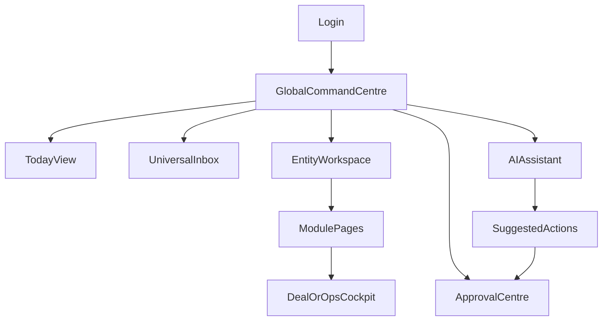

# UX Operating System — PivotOS

## Canonical Naming Glossary (Lock)
Use these labels exactly across all planning and build documents:

- **Global Command Centre** (not “command center” or generic “dashboard”)
- **Today View** (not “Today” when naming a core screen)
- **Universal Inbox**
- **Entity Workspace**
- **Quick Capture**
- **Command Bar**
- **AI Agent Workforce**
- **Automation Builder**
- **Idea-to-Wealth Engine**
- **Opportunity Cards**
- **Revenue Stream Builder**
- **Approval Centre**
- **Activity Log**
- **Audit Log**
- **Integrations Hub**

Phase naming lock:
- **Phase 2: Global Command Centre, Today View, Quick Capture**
- **Phase 7: Opportunity Cards + Idea-to-Wealth Engine**

## 1) How the App Should Feel Daily
PivotOS should feel like a calm, premium operating cockpit:
- Clear in 3 seconds
- Focused on decisions, not menus
- Powerful without being noisy
- Reliable under pressure
- Mobile-fast and thumb-friendly

Emotional outcome for user:
- “I know what matters now.”
- “Nothing critical will slip.”
- “I can execute fast.”

---

## 2) Daily Workflow of a Business Owner
### Morning (AI Daily War Room)
1. Open Global Command Centre
2. Review Top 3 Money Actions + Top 3 Urgent Ops
3. Review meetings + prep notes
4. Review follow-ups waiting >24h
5. Approve/decline high-risk AI actions
6. Start first focused execution block

### Midday (Execution + Adjust)
1. Process new Inbox items
2. Run entity-specific operations
3. Capture ideas/opportunities quickly
4. Update deal statuses and blockers

### End of Day (Close Loop)
1. Review what moved money/risk
2. Confirm tomorrow’s top actions
3. Clear “waiting on others” queue
4. Trigger summary reports

---

## 3) Global Command Centre Experience
Purpose:
- Single operational view across all allowed entities.

Primary cards (top to bottom):
1. Today’s Top Priorities
2. Urgent + Overdue
3. Meetings + Prep
4. Active Deals + Stuck Deals
5. Money In / Money Out Alerts
6. Follow-up Radar
7. AI Agent Updates
8. Next Best Actions
9. Opportunities Detected

Interaction rules:
- First screen = cards only
- Tap card -> drill into filtered list
- “All Entities” uses visible permission scope only

Empty state:
- Show guided “Start today” checklist + quick capture prompts.

---

## 4) Today View Experience
Purpose:
- Tactical day execution screen.

Layout:
- Top 3 priorities
- Top 3 money actions
- Day timeline
- Due tasks + waiting-on list
- Approvals needed
- AI recommendations
- End-of-day review checklist

Behavior:
- Auto-rank tasks by urgency, impact, time-to-money, risk
- One-tap reschedule/defer/escalate
- “Focus mode” collapses non-critical cards

---

## 5) Universal Inbox Processing
Purpose:
- One intake lane for all incoming noise.

Processing actions:
- assign entity/division
- classify type (task/deal/meeting/contact/doc/idea)
- create follow-up
- draft reply (email/WhatsApp)
- snooze/waiting/urgent/archive

AI defaults:
- pre-classify incoming records
- suggest best destination module
- detect duplicates and related records

UX guardrails:
- 3-click max to process most items
- bulk processing for repeated item types

---

## 6) Entity Switching
Principles:
- Entity context always visible
- Switching is instant and safe
- No mixed data leakage

Modes:
- Current entity
- All Entities overview

Rules:
- All writes happen in active entity unless explicitly changed
- Shared/global views are read-aggregated by permissions

---

## 7) Quick Capture
Capture types:
- text note
- task
- voice note
- image/screenshot
- lead/deal hint
- payment reminder
- idea/opportunity

UX:
- Floating quick-capture button on every page
- Global keyboard/mobile shortcut
- Minimal fields first, enrichment later

AI enrichment:
- auto-assign entity/module/contact/deal
- extract tasks and dates
- score opportunity potential

---

## 8) Command Bar
Universal actions:
- create task/meeting/deal/contact
- search anything
- ask AI
- jump entity
- open item by name
- run automation templates

Behavior:
- command grammar supports natural language
- recent/frequent commands prioritized
- permission-aware results only

---

## 9) AI Assistant Behavior
Assistant rules:
- contextual awareness (entity/page/record)
- propose first, execute after approval where needed
- explain “why this suggestion”
- always provide undo path where possible

Assistant surfaces:
- docked side panel
- inline card suggestions
- command-bar AI mode
- record-level co-pilot buttons

Response style:
- concise, actionable, ranked options

---

## 10) Progressive Disclosure Rules
Level 1: cards + simple status
Level 2: compact table/kanban/calendar/timeline
Level 3: detailed record + audit/history

Do:
- reveal complexity only when asked
- keep primary decisions one tap away

Avoid:
- dense dashboards on first view
- long forms before context

---

## 11) Mobile UX
Mobile priorities:
- thumb zone actions
- single-column card hierarchy
- sticky command and capture access
- fast transitions

Mobile patterns:
- bottom action rail
- swipe actions for triage
- quick chips for status changes
- tap-hold for context menu

Offline behavior:
- capture and edits always work offline
- visible sync state
- conflict prompts are human-readable

---

## 12) Dashboard UX
Dashboard architecture:
- KPI strip
- alert strip
- operational cards
- pipeline cards
- recommendation cards

View toggles:
- Card / Table / Kanban / Calendar / Timeline

Design tokens:
- calm dark base
- green accent for positive flow
- amber/red for risk/attention

Stitch alignment (active for this build):
- Use Manrope typography hierarchy from imported Stitch references.
- Use white/light surface cards with subtle borders and soft elevation.
- Keep primary action in green and secondary action in blue/neutral.
- Use rounded corners and compact status chips for readability on mobile.

---

## 13) Deal Cockpit UX
Deal cockpit sections:
1. Current stage + value + deadline
2. Next best action
3. People and communication timeline
4. Documents/checklists
5. Risk and blocker indicators
6. AI generated drafts/follow-ups

Core user actions:
- update stage
- create follow-up
- request approval
- trigger playbook

---

## 14) AI Daily War Room UX
Morning briefing includes:
- top revenue opportunities
- urgent admin risks
- stalled workflows
- follow-up priorities
- meeting prep tasks

Outputs:
- short action list
- prioritized schedule blocks
- suggested delegations

Interaction:
- accept, edit, or reject plan in one screen

---

## 15) Avoiding Overwhelm
Framework:
- “Now / Next / Later” lanes
- max 3 top priorities
- hide low-priority details by default
- weekly archive and cleanup prompts

System nudges:
- if >N overdue tasks, propose triage mode
- if many unprocessed inbox items, suggest bulk workflows

---

## 16) Empty States
Every empty state must:
- explain value in one sentence
- provide one primary action
- provide one import/capture shortcut
- show sample data option for learning

Examples:
- Deals empty -> “Create first deal from inbox or quick capture.”
- Meetings empty -> “Schedule your next high-impact meeting.”

---

## 17) Notifications and Approvals
Notification tiers:
- critical (risk/money/security)
- important (due/blocked/follow-up)
- info (summaries/updates)

Approval centre:
- all risky actions in one queue
- one-tap approve/decline with context preview
- mandatory reason capture for sensitive declines

---

## 18) UX Risks and How to Avoid Them
1. **Menu sprawl**
   - Mitigation: role/module-based nav personalization.
2. **AI noise**
   - Mitigation: confidence thresholds + relevance filters.
3. **Cross-entity confusion**
   - Mitigation: persistent entity badges and write-context warnings.
4. **Form fatigue**
   - Mitigation: quick capture + progressive forms.
5. **Mobile friction**
   - Mitigation: thumb-first controls, reduced taps, offline support.

---

## 19) Make It Simple but Powerful
Core rule:
- Simplicity on first interaction, power on demand.

Implementation standards:
- one primary action per major card
- explicit state labels (urgent, waiting, blocked, approved)
- context-preserving navigation
- no dead-end screens

Success criteria:
- user can run daily operations in <30 minutes planning overhead
- user can process inbox quickly
- user always knows next best action

---

## 20) Development Phase Alignment (from MASTERPLAN.md)
This UX document follows the exact same build order as `MASTERPLAN.md` section `23) Development Phases`.

- Phase 0: product clarity + UX architecture + schema planning
- Phase 1: auth, entities, roles, permissions, base RLS
- Phase 2: Global Command Centre, Today View, Quick Capture
- Phase 3: inbox, tasks, meetings, projects, notes
- Phase 4: contacts, CRM, deals, activity logs
- Phase 5: docs/files/reports
- Phase 6: finance basics + assets
- Phase 7: Opportunity Cards + Idea-to-Wealth Engine
- Phase 8: integration registry/manual connectors
- Phase 9: Google Workspace integration
- Phase 10: Airtable sync
- Phase 11: WhatsApp integration + draft replies
- Phase 12: website lead capture
- Phase 13: property workflows
- Phase 14: social content engine
- Phase 15: Jira/Confluence integration
- Phase 16: accounting/payment integrations
- Phase 17: advanced AI agent automation
- Phase 18: polish, performance, deployment

---

## UX Component Blueprint (Reference)

## UX Operating Rules Checklist
- Mobile-first layouts for all primary pages
- Offline capture on critical modules
- Entity context always visible
- AI suggestions always explainable
- Risk actions always approval-gated
- Cards first, dense data second
