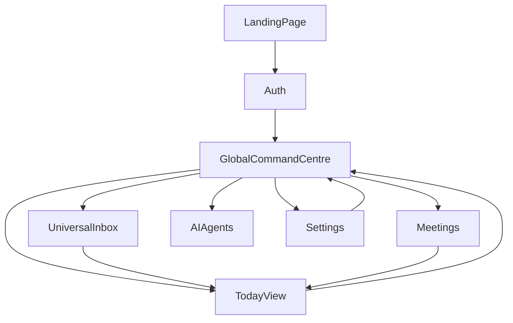

# PivotOS Wireframe Layout System

## 1) Purpose
This document is the practical screen wireframe blueprint for building PivotOS consistently across mobile and desktop.

It works with:
- `MASTERPLAN.md`
- `UX_OPERATING_SYSTEM.md`
- `INTEGRATION_AND_AI_AGENT_BLUEPRINT.md`
- `DESIGN_RULES.md`

---

## 2) Canonical Screen Set (Build Order)
1. Public Landing Page (signed-out)
2. Auth (login/register)
3. Global Command Centre
4. Today View
5. Universal Inbox
6. Meetings
7. Tasks
8. Contacts/CRM
9. Deals
10. Settings + Team Access

---

## 3) Global Layout Shell

## Mobile Wireframe
- Top bar:
  - current page title
  - compact status line (sync + online/offline)
- Context filters:
  - Entity selector
  - Division selector (if available)
- Main content:
  - stacked cards
- Bottom nav:
  - Command
  - Today
  - Inbox
  - Agents
  - Settings

## Desktop Wireframe
- Same structure, wider content container.
- Filters and status shown in one top area.
- Card grids may switch from 1 column -> 2/3 columns where useful.

---

## 4) Public Landing Page (Signed-Out)
Purpose:
- explain value quickly
- get user to start/login
- provide trust and clarity

Layout zones:
1. Hero (headline + CTA + visual)
2. “One Hub, Four Worlds” value cards
3. AI capability strip
4. Use-case blocks
5. CTA/footer

Primary actions:
- Get started
- Watch demo

States:
- normal
- mobile compact

---

## 5) Auth Screen
Purpose:
- friction-light entry
- clear alternatives (magic link/password/offline where allowed)

Layout zones:
1. Brand/benefit intro card
2. Method switch (email/password/offline)
3. Input block
4. Primary submit action
5. help/error state

---

## 6) Global Command Centre
Purpose:
- first signed-in screen
- tell user what matters now

Layout zones:
1. Focus scope card (entity + status chips)
2. KPI row (Urgent / In Progress / Waiting / Inbox)
3. Next Best Actions list
4. Operational action cards:
   - Meetings
   - Follow-ups
   - AI updates

Primary actions:
- Open Today View
- Process Inbox
- Open Meetings
- Open AI Agents

Empty state:
- “No urgent items” + suggest one strategic next action

---

## 7) Today View
Purpose:
- daily execution cockpit

Layout zones:
1. Focus card + daily status chips
2. Top 3 Outcomes card
3. Quick action row:
   - Start next action
   - Command Centre
   - Meetings
   - Process inbox
4. Next actions lane:
   - In progress block
   - Planned tasks list

States:
- no plan
- has plan
- has in-progress task

---

## 8) Universal Inbox
Purpose:
- central intake for all noise

Layout zones:
1. Capture composer
2. Context hint (current focus)
3. Recent inbox list
4. Item action row per item:
   - Make task
   - Delete
   - (next: classify/deal/contact/meeting)

Future controls slot:
- classify
- assign entity/division
- convert to deal/contact/opportunity

---

## 9) Meetings
Purpose:
- schedule and manage meeting execution

Layout zones:
1. Quick entry form
2. Weekly timeline list
3. Active links cards (meetings/attendees/past)

Future details panel:
- agenda
- notes
- extracted follow-up tasks
- linked deal/contact/files

---

## 10) Tasks
Purpose:
- execution across entities

Layout zones:
1. Task status summary chips
2. Task groups:
   - urgent
   - in progress
   - waiting
   - planned
3. Task quick actions:
   - start
   - mark done
   - reschedule

---

## 11) Contacts/CRM
Purpose:
- relationship memory and follow-up control

Layout zones:
1. Contact search + quick add
2. Relationship highlights
3. Follow-up due lane
4. Linked deals/messages/tasks

---

## 12) Deals
Purpose:
- track money-moving opportunities

Layout zones:
1. Pipeline summary
2. Deal cards by stage
3. Deal cockpit detail:
   - value
   - risk
   - next action
   - timeline
   - docs/comms

---

## 13) Settings + Team Access
Purpose:
- account controls + entity access

Layout zones:
1. Account section
2. Team Access section:
   - invite form
   - members list
   - role controls
   - pending invites
3. Local controls
4. integrations/webhooks summary

---

## 14) Cross-Screen Component Inventory
- App shell top bar
- Entity/Division filters
- Card container
- Status pill
- KPI card
- Primary button
- Secondary button
- Form field
- Empty state block
- Error state block

---

## 15) State System (Each Screen Must Have)
- Loading
- Empty
- Active/data-present
- Error
- Offline/queued-sync

---

## 16) Responsive Behavior Rules
- Mobile first (single column default)
- Desktop expands to multi-column card grids
- No hidden critical action on mobile
- Keep core CTA visible above fold

---

## 17) Navigation Flow Map

---

## 18) Wireframe Quality Checklist
- One primary action per section
- Clear hierarchy (title > context > action)
- Cards first, dense data second
- Entity context always visible
- Approval-sensitive actions separated
- Mobile touch targets comfortable
- No dead-end pages

---

## 19) Next Wireframe Expansion
After core set is stable, add detailed wireframes for:
- Projects
- Documents
- Reports
- Automations
- AI Agent cards panel
- Opportunity Cards
- Revenue Stream Builder
